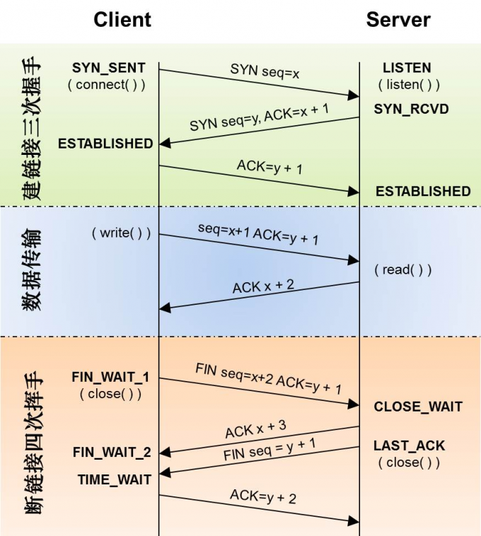

# 谈一谈TCP/IP三次握手，四次挥手？
TCP用三次握手来创建连接，使用四次分手来释放连接。

## 三次握手

> [!TIP]
> **第一次握手**：建立连接，客户端先发送连接请求报文，将SYN设置为1，Sequence Number为x。客户端进入SYN+SEND状态，等待服务器确认。   
> 
> **第二次握手**：服务器收到SYN报文。服务器收到客户端的SYN报文，需要对这个SYN报文进行确认，设置Acknowledgment Number为x+1(Sequence+1)；同时，自己还要送法SYN消息，将SYN位置为1，Sequence Number为y；服务器将上述所有信息放到一个报文段(即SYN+ACK报文段)中，一并发送给客户端，此时服务器进入SYN+RECV状态。   
> 
> **第三次握手**：客户端收到服务器的 SYN+ACK报文段。然后将Acknowlegment Number设为y+1,向服务器发送ACK报文段，这个报文段发送完毕后，客户端端服务器都进入ESTABLISHED状态，完成TCP三次握手。

完成了三次握手，客户端和服务器就可以开始传送数据了。

## 四次挥手
当客户端和服务端传输数据完毕后，需要断开TCP连接。TCP断开的过程，就是四次挥手。

> [!NOTE]
> **第一次挥手** ：客户端(也可以是服务器)，设置Sequence Number和Acknowledgment Number，向服务器发送一个FIN报文段。此时客户端进入FIN_WAIT_1状态；这表示客户端没有数据发送给主机了。
>
> **第二次挥手**：服务器收到客户端发来的FIN报文段，向客户端回一个ACK报文段，Acknowledgement Number为Sequence Number加1；客户端进入FIN_WAIT_2状态，服务器进入CLOSE_WAIT状态；服务器告诉客户端，我同意你的”关闭”请求。
> 
> **第三次挥手**：服务器向客户端发送FIN报文段，请求关闭连接，同时服务器进入LAST_ACK状态。
> 
> **第四次挥手** ：客户端收到服务器发送的FIN报文段，向主机发送ACK报文段，然后客户端进入TIME_WAIT状态，服务器收到客户端的ACK报文段以后，就关闭连接，此时，客户端等待2MSL后一次没有到收到回复，则证明服务端已正常关闭，那好，客户端也可以关闭连接了。

## TCP三次握手的必要性
防止服务器端因接收了早已失效的连接请求报文，从而一直等待客户端请求，最终导致形成死锁、浪费资源。

## TCP四次挥手的必要性
为了保证通信双方都能通知对方，需释放、断开连接。

### 为什么客户端关闭连接前要等待2MSL时间
> [!WARNING]
> MSL: 最大报文段生存时间

四个报文发送完毕后，就可以直接进入CLOSE状态了，但是有可能网络是不可靠的，一切都可能发生，比如有可能最后一个ACK丢失。所以TIME_WAIT状态是用来重发可能丢失的ACK报文。展开具体来讲：
* 为了保证客户端发送的最后1个连接释放确认报文 能到达服务器，从而使得服务器能正常释放连接。
* 防止早已失效的连接请求报文，出现在本连接中。客户端发送了最后1个连接释放请求确认报文后，再经过2MSL时间，则可使本连接持续时间内所产生的所有报文段都从网络中消失。

# 参考
* [TCP三次握手和四次挥手](https://yeungeek.github.io/2019/06/21/Network-TCP-IP/#TCP%E4%B8%89%E6%AC%A1%E6%8F%A1%E6%89%8B%E5%92%8C%E5%9B%9B%E6%AC%A1%E6%8C%A5%E6%89%8B)
* [TCP的三次握手与四次挥手（详解+动图）](https://blog.csdn.net/qzcsu/article/details/72861891)