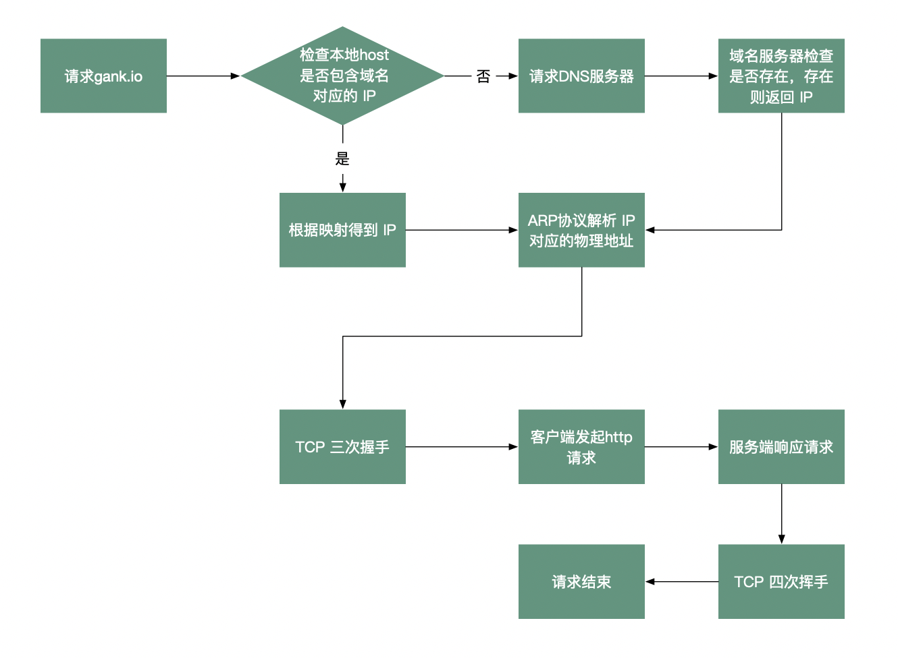
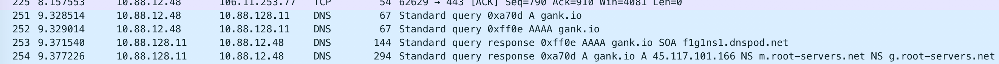
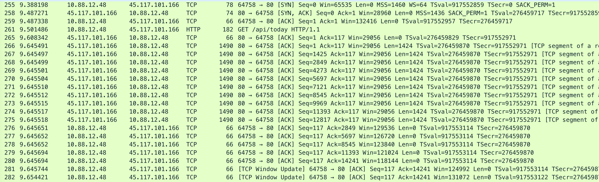
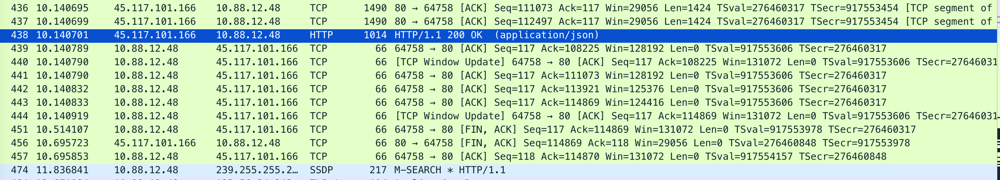
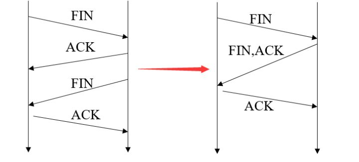

一次http网络请求的流程，以请求http://gank.io/api/today 为例。  
流程图：

其中TCP三次握手，四次挥手都是面试中会考察的，等后面的面试题再进行介绍。    
下面通过 wireshark抓包看下，主要流程：

1. DNS解析IP


2. TCP 三次握手


3. 服务端响应，TCP四次挥手

这里 TCP 四次挥手和普通稍微有点不一样。  
``` C++
456	10.695723	45.117.101.166	10.88.12.48	TCP	66	80 → 64758 [FIN, ACK] Seq=114869 Ack=118 Win=29056 Len=0 TSval=276460848 TSecr=917553978
```
服务端 FIN,ACK 一起发送过来，就变成了三次挥手了



[完整的 TCP 三次握手和 TCP 四次挥手](https://yeungeek.github.io/2019/06/21/Network-TCP-IP/#TCP%E4%B8%89%E6%AC%A1%E6%8F%A1%E6%89%8B%E5%92%8C%E5%9B%9B%E6%AC%A1%E6%8C%A5%E6%89%8B)